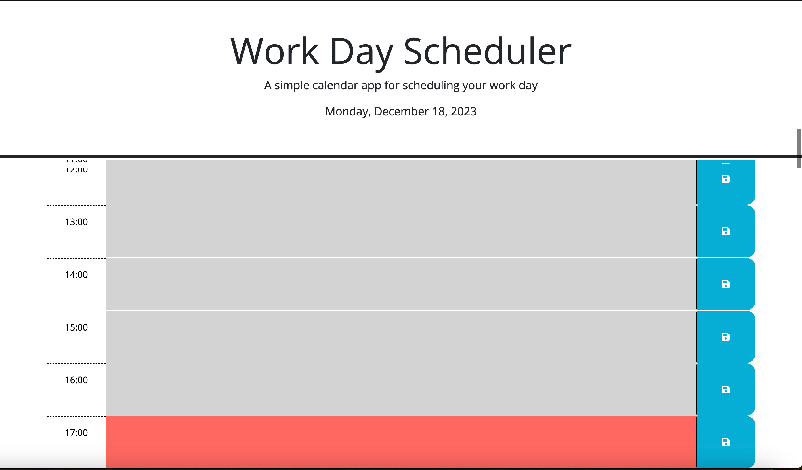

# Daily Planner Refactor README

## Intoduction
This is the README for the Daily Planner Refactor of my coding bootcamp. This Repository contains an HTML and CSS file for the website for a Daily Planner. These files were supplied to me through a Gitlab repo so that I could make the planner function through a combination of jquery and javascript.

## Things Learned
Through this challenge, I was able to learn how to use javascript/JQuery to add functionality to a prebuilt website; work with Github; and practice HTML, Javascript, and JQuery;

### Link to Deployed REPO
[Click me!](https://spikey1289.github.io/Daily_Planner_Refactor/)

### Screenshot of Finished Website
